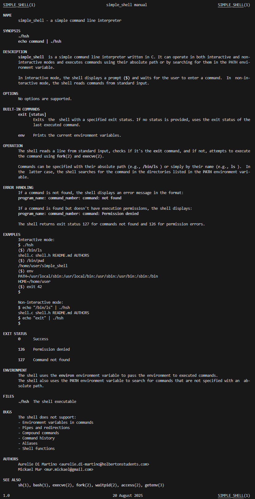

# Simple Shell

## Description

Ce projet implémente un shell simple en langage C dans le cadre de la formation Holberton School. Ce shell peut interpréter et exécuter des commandes de base en mode interactif et non-interactif.

## Fonctionnalités

- Mode interactif avec prompt `($) `
- Mode non-interactif (exécution via pipe)
- Exécution de commandes avec chemin absolu et recherche dans PATH
- Commandes intégrées (`exit`, `env`, etc.)
- Parsing avancé des commandes et arguments
- Gestion complète des erreurs et messages d'erreur appropriés
- Gestion des lignes vides et espaces
- Architecture modulaire pour une maintenance facile

## Compilation

Pour compiler le shell, utilisez la commande suivante :

```bash
gcc -Wall -Werror -Wextra -pedantic -std=gnu89 *.c -o hsh
```

## Utilisation

### Mode interactif

Lancez le shell en mode interactif :

```bash
./hsh
```

Le shell affichera un prompt `($) ` et attendra vos commandes.

### Mode non-interactif

Vous pouvez également utiliser le shell en mode non-interactif :

```bash
echo "ls" | ./hsh
```

```bash
echo "pwd" | ./hsh
```

## Structure du projet

```
.
├── AUTHORS             # Liste des contributeurs
├── README.md           # Documentation du projet
├── man_1_simple_shell  # Page de manuel
├── img/                # Ressources visuelles et documentation
├── shell.h             # Fichier d'en-tête principal
├── shell.c             # Point d'entrée et boucle principale
├── parsing.c           # Parsing des commandes et arguments
├── path.c              # Gestion du PATH et recherche d'exécutables
├── exec_command.c      # Exécution des commandes
├── builtins.c          # Implémentation des commandes intégrées
└── read_line.c         # Lecture et traitement des entrées utilisateur
```

## Commandes supportées

### Commandes intégrées

- `exit` : Quitte le shell
- `env` : Affiche les variables d'environnement


### Commandes externes

Le shell peut exécuter :
- Commandes avec chemin absolu (`/bin/ls`, `/bin/pwd`, etc.)
- Commandes recherchées dans PATH (`ls`, `pwd`, `whoami`, etc.)
- Programmes personnalisés accessibles via PATH


## Exemples d'utilisation

```bash
$ ./hsh
($) ls
AUTHORS  README.md  builtins.c  exec_command.c  img  man_1_simple_shell  parsing.c  path.c  read_line.c  shell.c  shell.h
($) /bin/pwd
/home/user/holbertonschool-simple_shell
($) whoami
user
($) env
PATH=/usr/local/sbin:/usr/local/bin:/usr/sbin:/usr/bin:/sbin:/bin
HOME=/home/user
...
($) exit
$
```

## Tests avec Valgrind

Pour vérifier les fuites mémoire avec Valgrind :

### Test complet des fuites mémoire
valgrind --leak-check=full --show-leak-kinds=all --track-origins=yes ./hsh

### Test en mode non-interactif
echo "/bin/ls" | valgrind --leak-check=full ./hsh


## Gestion des erreurs

Le shell gère les erreurs suivantes :

- Commandes non trouvées : affiche un message d'erreur avec le nom du programme, le numéro de commande et le nom de la commande
- Erreurs de fork() : affiche un message d'erreur système
- Erreurs d'exécution : gestion appropriée des codes de retour
- Fin de fichier (EOF) : quitte proprement le shell
- Mémoire insuffisante : gestion des erreurs d'allocation

## Tests et conformité

Le shell a été testé pour :
- ✅ Conformité avec les standards de codage Holberton (Betty style)
- ✅ Compilation sans warnings avec les flags `-Wall -Werror -Wextra -pedantic`
- ✅ Fonctionnement en mode interactif et non-interactif
- ✅ Gestion correcte de la mémoire (pas de fuites)
- ✅ Compatibilité avec les shells UNIX standard


## Manuel (man page)

img/man_1_simple_shell.png


## Flowchart du processus


Étapes principales :
1. **Initialisation** : Démarrage du shell et affichage du prompt
2. **Lecture** : Capture de l'entrée utilisateur (interactive ou pipe)
3. **Parsing** : Analyse et tokenisation de la commande
4. **Résolution** : Recherche de l'exécutable (PATH ou builtin)
5. **Exécution** : Fork et exec de la commande
6. **Attente** : Attente de la fin du processus enfant
7. **Boucle** : Retour au prompt pour la prochaine commande


## Licence

Ce projet est réalisé dans le cadre de la formation Holberton School.

---
<br><br><br>


<br>

# Simple Shell (English Version)

## Description

This project implements a simple shell in C language as part of the Holberton School curriculum. This shell can interpret and execute basic commands in both interactive and non-interactive modes.

## Features

- Interactive mode with `($) ` prompt
- Non-interactive mode (pipe execution)
- Command execution with absolute path and PATH lookup
- Built-in commands (`exit`, `env`, etc.)
- Advanced command and argument parsing
- Comprehensive error handling and appropriate error messages
- Empty lines and whitespace handling
- Modular architecture for easy maintenance

## Compilation

To compile the shell, use the following command:

```bash
gcc -Wall -Werror -Wextra -pedantic -std=gnu89 *.c -o hsh
```

## Usage

### Interactive Mode

Launch the shell in interactive mode:

```bash
./hsh
```

The shell will display a `($) ` prompt and wait for your commands.

### Non-interactive Mode

You can also use the shell in non-interactive mode:

```bash
echo "ls" | ./hsh
```

```bash
echo "pwd" | ./hsh
```

## Project Structure

```
.
├── AUTHORS             # List of contributors
├── README.md           # Project documentation
├── man_1_simple_shell  # Manual page
├── img/                # Visual resources and documentation
├── shell.h             # Main header file
├── shell.c             # Main entry point and processing loop
├── parsing.c           # Command and argument parsing
├── path.c              # PATH management and executable search
├── exec_command.c      # Command execution
├── builtins.c          # Built-in command implementation
└── read_line.c         # User input reading and processing
```

## Supported Commands

### Built-in Commands

- `exit` : Exits the shell
- `env` : Displays environment variables

### External Commands

The shell can execute:
- Commands with absolute path (`/bin/ls`, `/bin/pwd`, etc.)
- Commands searched in PATH (`ls`, `pwd`, `whoami`, etc.)
- Custom programs accessible via PATH

## Usage Examples

```bash
$ ./hsh
($) ls
AUTHORS  README.md  builtins.c  exec_command.c  img  man_1_simple_shell  parsing.c  path.c  read_line.c  shell.c  shell.h
($) /bin/pwd
/home/user/holbertonschool-simple_shell
($) whoami
user
($) env
PATH=/usr/local/sbin:/usr/local/bin:/usr/sbin:/usr/bin:/sbin:/bin
HOME=/home/user
...
($) exit
$
```

## Error Handling

The shell handles the following errors:

- Command not found: displays error message with program name, command number, and command name
- Fork() errors: displays system error message
- Execution errors: proper handling of return codes
- End of file (EOF): exits the shell cleanly
- Insufficient memory: allocation error handling

## Testing and Compliance

The shell has been tested for:
- ✅ Compliance with Holberton coding standards (Betty style)
- ✅ Compilation without warnings with `-Wall -Werror -Wextra -pedantic` flags
- ✅ Functioning in both interactive and non-interactive modes
- ✅ Proper memory management (no leaks)
- ✅ Compatibility with standard UNIX shells


## Valgrind Testing

To check for memory leaks with Valgrind:

### Complete memory leak test
valgrind --leak-check=full --show-leak-kinds=all --track-origins=yes ./hsh

### Non-interactive mode test
echo "/bin/ls" | valgrind --leak-check=full ./hsh


## Manual (man page)




## Process Flowchart


Main steps:
1. **Initialization** : Shell startup and prompt display
2. **Reading** : User input capture (interactive or pipe)
3. **Parsing** : Command analysis and tokenization
4. **Resolution** : Executable search (PATH or builtin)
5. **Execution** : Fork and exec of the command
6. **Waiting** : Wait for child process completion
7. **Loop** : Return to prompt for next command

## License

This project is carried out as part of the Holberton School curriculum.
